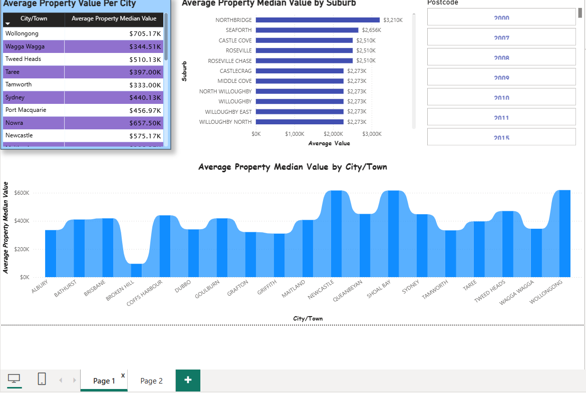
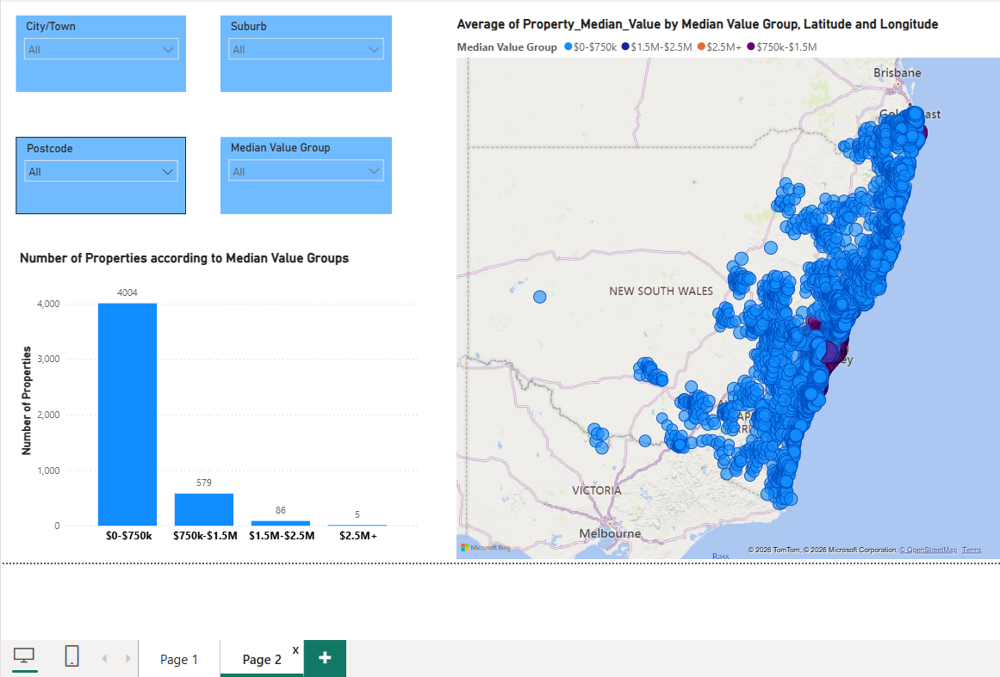

# Australian Property Analysis | End-to-End BI Solution

**From mixed state-level files to location-based property intelligence.**

This project brings together Australian geography, property values, rental values, schools, transport and crime data. It demonstrates the complete BI delivery path: source profiling and standardisation, SSIS ETL, dimensional modelling, SQL analysis, SSRS reporting and Power BI dashboards.

It is an evidence-first portfolio repository: every technical artefact is original project work. The README explains the purpose and data decisions; it does not claim work that is not present in the files.

## The business question

How can location - state, city/town, suburb and postcode - be used to compare property values alongside rental, school, transport and crime context?

The outcome is a reporting model that helps a user move from a geographic view to local detail, rather than looking at a property-value figure in isolation.

## Solution at a glance


| Pipeline stage | Evidence in this repository |
| --- | --- |
| Source data | Raw Excel inputs for geography, property values, rental values, schools, transport and crime |
| SSIS | The actual `.dtsx` package, plus control-flow and data-load captures |
| Warehouse | Captured dimensional schema and bus-matrix evidence |
| SQL | Actual property-analysis queries |
| SSRS | An `.rdl` definition, five exported reports and preview images |
| Power BI | Four original `.pbix` reports and dashboard screenshots |

## Data in the wild: what had to be standardised

This was not a single clean table. The raw files make the integration problem visible:

| Subject area | Raw inputs | Example integration challenge |
| --- | --- | --- |
| Geography | 15,421 location rows with suburb, city, state, coordinates | Provides the common location backbone for reporting |
| House value | 6,064 rows across NSW, SA and VIC | NSW includes postcode; SA and VIC source files do not |
| Rental value | 14,719 rows across NSW, SA and VIC | Grain includes `RentalHouseType`, unlike the house-value files |
| Schools | 6,573 rows across NSW, SA and VIC | The postcode field varies as `postcode`, `Post Code` and `Postal_Postcode` |
| Transport | 12,060 rows across NSW, SA and VIC | Longitude appears as `stop_long` in NSW and `stop_lon` elsewhere |
| Crime | 360,999 rows | Grain is locality/postcode plus offence category and subcategory, so it must be aggregated for a location summary |

The source files also mix `suburb`, `Suburb` and `SUBURB` values, and use different casing across states. These differences make reliable joins impossible until field names, data types and location keys are aligned.

### What the ETL package actually does

The included SSIS package shows local-file/Excel ingestion, staging tables, data conversion, dimensional loads and fact-table lookups. Its control flow covers geography, property, schools, years and categories. The advanced source captures also show multi-state rental, school and transport feeds being combined with **Union All** before loading a common staging layer.


The package includes lookups to `Dim_Aus_Geography`, `Dim_Property`, `Dim_Aus_School`, `Dim_Year` and `Dim_Category` before loading the fact table. This makes the model usable for filtering and comparing data consistently across subject areas.

> **Portability note:** the original SSIS package uses local connection-manager paths and a local SQL Server instance. It opens in Visual Studio/SSDT with the SSIS extension; update those connection managers to your own files and server before execution.

## Warehouse model

The captured model evidence records a dimensional approach: shared geography and subject-area dimensions support facts for the property analysis workflow.


The bus-matrix capture is retained in [03-data-warehouse/evidence](03-data-warehouse/evidence/) alongside the model image.

## SQL analysis

The [property analysis SQL script](04-sql/property_analysis_queries.sql) is the original query work. It:

- counts cities by state from `AUS_Post_suburb`;
- counts unique suburbs and postcodes by city; and
- calculates average property median value by suburb, postcode and suburb-postcode, filtering null property values where appropriate.

The file can be opened in any text editor. To execute it, use SQL Server with the project tables available; the database backup is intentionally excluded from GitHub because it is a binary, environment-specific artefact.

## SSRS reporting

Five actual SSRS exports show the reporting layer for house value, rental value, schools, transport and recorded crime. The repository also includes the original `Rental_report.rdl` report definition.

| Report | PDF export |
| --- | --- |
| House value | [House_Report.pdf](05-ssrs-reporting/exports/House_Report.pdf) |
| Rental value | [Rental_Report.pdf](05-ssrs-reporting/exports/Rental_Report.pdf) |
| Schools | [School_Report.pdf](05-ssrs-reporting/exports/School_Report.pdf) |
| Transport | [Transport_Report.pdf](05-ssrs-reporting/exports/Transport_Report.pdf) |
| Crime | [Crime_Report.pdf](05-ssrs-reporting/exports/Crime_Report.pdf) |

The report previews and an additional SSRS competition-sprint screenshot are available in [05-ssrs-reporting/previews](05-ssrs-reporting/previews/). Open the `.rdl` in SQL Server Data Tools or Report Builder to inspect the report definition.

## Power BI dashboards

The primary Power BI report contains a **Summary** page plus pages for **House Value, Rental Value, School Data, Transport Data and Crime Data**. The supporting files include two earlier Property Analysis reports and an SSRS-linked Power BI report.



The visible suburb ranking puts Northbridge at `$3.210M`, Seaforth at `$2.656M` and Castle Cove at `$2.510M` in the selected view. City/town, suburb and postcode controls support the move from broad comparison to local detail.



With the controls set to **All**, this captured page shows 4,004 properties in the `$0-$750K` group, compared with 579 in `$750K-$1.5M`, 86 in `$1.5M-$2.5M` and 5 in `$2.5M+`. The map makes the distribution of these groups geographically visible.

### Open the original reports

- [Advance Task 5 - SSRS linked to Power BI](06-powerbi/reports/Advance%20Task%205%20SSRS%20linking%20to%20Power%20Bi.pbix)
- [Advanced Property Analysis report](06-powerbi/reports/Advance%20Task%20Part%204%20Power%20Bi%20report.pbix)
- [Property Analysis dashboard](06-powerbi/reports/Property%20Analysis%20Power%20BI%20Dashboard.pbix)
- [Competition Sprint report](06-powerbi/reports/Task%202%20Competition%20Sprint.pbix)

Open these files in Power BI Desktop. GitHub cannot preview a `.pbix`, which is why the screenshots above are included.

## Repository structure

```text
property-analysis-bi/
├── 01-data-sources/raw/           # Original advanced-sprint Excel inputs
├── 02-ssis-etl/                   # Original SSIS package and evidence captures
├── 03-data-warehouse/             # Model and bus-matrix evidence
├── 04-sql/                         # Original property SQL queries
├── 05-ssrs-reporting/              # RDL, five PDF exports and previews
├── 06-powerbi/                     # Four PBIX reports and screenshots
├── assets/
└── README.md
```

## Run and review guide

| File type | What an employer can do |
| --- | --- |
| `.sql` | Open and read every saved command in any editor; execute in SQL Server once the matching tables are loaded |
| `.xlsx` | Inspect the original source data in Excel or another spreadsheet tool |
| `.dtsx` | Open in Visual Studio/SSDT with SSIS tooling; replace local connection-manager paths before running |
| `.rdl` / `.pdf` | Open the report definition in Report Builder/SSDT or inspect the delivered exports directly |
| `.pbix` | Open the interactive reports in Power BI Desktop |

## What is intentionally excluded

MP4 recordings, database backup files, assignment instructions, solution documents, certificates, duplicate datasets and IDE cache files. They do not help a recruiter evaluate the solution and would make the repository slower and less focused.

## Next improvement

For version-controlled BI development, save the Power BI reports as `.pbip` projects and add database DDL/load scripts with parameterised connection settings. The current repository preserves the original deliverables and makes them easy to review; those additions would make the pipeline reproducible from a fresh SQL Server instance.
